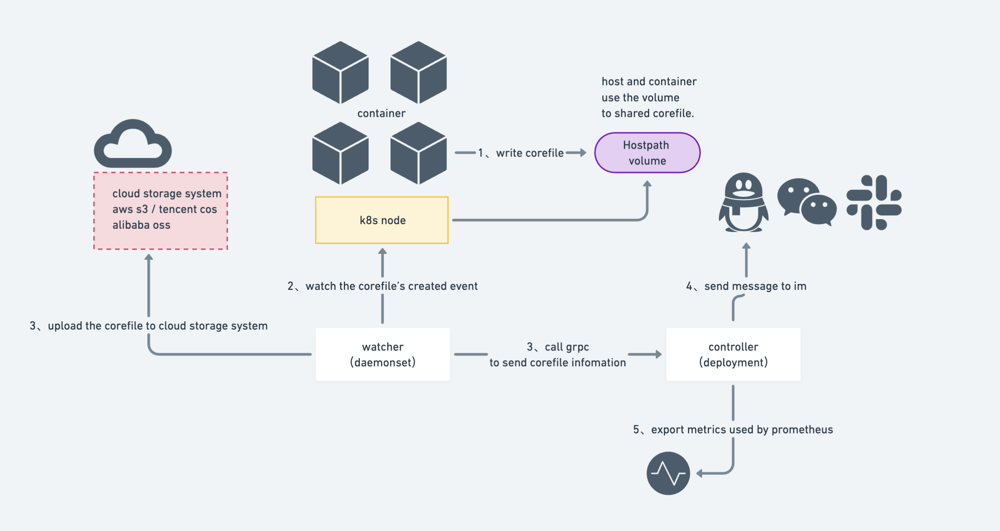

# Coredog 🐶

Coredog is an open-source project designed to monitor and manage core dumps in a Kubernetes cluster. It automatically detects core files generated by applications running in the cluster, uploads them to an S3-compatible object storage system, and provides pre-signed S3 download links to all developers through instant messaging software.

## Table of Contents

1. [Architecture](#architecture)
2. [Features](#features)
3. [Prerequisites](#prerequisites)
4. [Getting Started](#getting-started)
5. [Configuration](#configuration)
6. [Deployment](#deployment)
7. [Usage](#usage)
8. [License](#license)
9. [Contributors](#Contributors)

## Architecture


The above diagram represents the high-level architecture of Coredog. It showcases the key components and their interactions.

## Features

- Real-time monitoring of core files generated in the Kubernetes cluster
- Automatic upload of core files to an S3-compatible object storage system
- Pre-signed S3 download links shared with all developers via instant messaging software
- Easy configuration and deployment using Helm charts

## Prerequisites

Before deploying Coredog, ensure that you have the following prerequisites:

- A Kubernetes cluster with at least one node
- A running instance of an S3-compatible object storage system (e.g., MinIO, Amazon S3)
- An instant messaging software that supports sharing pre-signed URLs (e.g., Slack, Microsoft Teams)
- Helm installed on your local machine

## Getting Started

To get started with Coredog, clone the repository to your local machine:

```bash
git clone https://github.com/DomineCore/coredog.git
cd coredog
```

## Configuration

Before deploying Coredog, you need to update the `charts/values.yaml` file with your S3-compatible object storage system and instant messaging software settings. Here's a brief overview of the available configuration options:

```yaml
config:
  watcher.yaml: |-
    ScrapePaths: ["/core/dump"]
    StorageConfig:
      enabled: true
      protocol: s3
      s3AccesskeyID: "s3AccesskeyID"
      s3SecretAccessKey: "s3SecretAccessKey"
      s3Region: "ap-nanjing"
      S3Bucket: "bucket"
      S3Endpoint: "endpoint"
      StoreDir: corefiles
      PresignedURLExpireSeconds: 3600

  controller.yaml: |-
    NoticeChannel:
    - chan: slack
      webhookurl: "url" ## 
    - chan: wechat
      webhookurl: "url"

## Define your corefile source storage
corefileVolume:
  type: hostPath
  name: corefile
  hostPath:
    path: /root/core
    type: Directory
  emptyDir: {}
  persistentVolumeClaim:
    claimName: my-pvc
```

## Deployment

To deploy Coredog to your Kubernetes cluster using Helm, navigate to the `charts` directory and run the following command:

```bash
helm install coredog ./coredog
```

This will create a new Helm release named `coredog` and deploy the Coredog chart to your Kubernetes cluster.

## Usage

Once Coredog is deployed, it will automatically monitor the Kubernetes cluster for core files and upload them to the specified S3-compatible object storage system. Pre-signed S3 download links will be shared with all developers through the specified instant messaging software.


## License

Coredog is licensed under the [MIT License](LICENSE).

## Contributors

<!-- readme: collaborators,contributors -start -->
<table>
<tr>
    <td align="center">
        <a href="https://github.com/DomineCore">
            
            <br />
            <sub><b>Core</b></sub>
        </a>
    </td>
    <td align="center">
        <a href="https://github.com/levvli">
            
            <br />
            <sub><b>Levvli</b></sub>
        </a>
    </td></tr>
</table>
<!-- readme: collaborators,contributors -end -->
